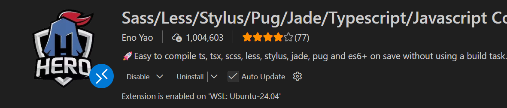
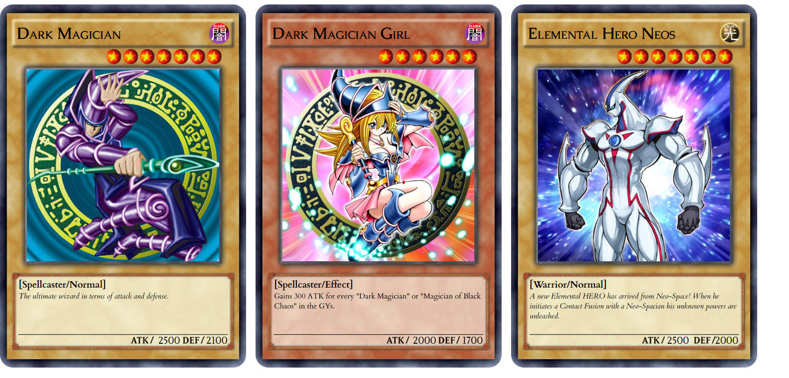

# 🎴 Yu-Gi-Oh! Card 
Benvenuti in questo progetto di generazione di carte di Yu-Gi-Oh! creato con **Pug** e **Sass**. Questo sistema permette di creare carte fedeli all'originale in modo modulare e veloce.

## 🚀 Tecnologie Utilizzate
Il progetto sfrutta la potenza del pre-processing per mantenere il codice pulito:
- **HTML5** (Generato tramite **Pug**)
- **CSS3** (Generato tramite **Sass/SCSS**)
- **Google** Fonts (Lustria, Cardo, Caudex)
- **Compile** Hero Pro (Per l'automazione del workflow)

## 🛠️ Configurazione e Compilazione
Per visualizzare correttamente il progetto e compilarlo, è necessario utilizzare l'estensione **Compile Hero**.

### 1. Estensione Consigliata
Scarica e installa Compile Hero dal VS Code Marketplace: 👉 https://marketplace.visualstudio.com/items?itemName=Wscats.eno 

### 2. Configurazione Importante (JSON)
Per evitare errori di compilazione dei moduli Sass (partial) e mantenere la cartella pulita, assicurati di avere la cartella `.vscode` con il seguente file `settings.json`:

    {
        "compile-hero.disable-compile-files-on-did-save-code": false,

        "compile-hero.ignore": [
            "**/scss/**",
            "**/pug/**",
            "**/node_modules/**",
            ".vscode"
        ]
    }

###  3. Come compilare
1. Apri il progetto in VS Code.
2. Apri i file principali: `index.pug` e `style.scss`.
3. Salva i file (`Ctrl + S`). L'estensione genererà automaticamente i file finali nella cartella dist.

## 📁 Struttura del Progetto
- `index.pug`: Struttura principale delle carte.
- `style.scss`: File maestro che unisce tutti i moduli CSS.
- `scss/`: Cartella contenente i moduli Sass:
    - `_variables.scss`: Colori, font e percorsi immagini.
    - `_mixins.scss`: Logica riutilizzabile per stelle e sfondi.
    - `_base.scss`: Reset globale e layout del contenitore.
    - `_card.scss`: Anatomia dettagliata della carta.
- `dist/`: Risultato finale. Qui troverai l' `index.html` e il `style.css` pronti per essere aperti nel browser.

## 📸 Risultato Finale
Ecco come appaiono le carte una volta compilate:

## 🎨 4. Crediti e Risorse
Tutti gli elementi grafici (frame, attributi, stelle e texture) utilizzati in questo progetto provengono dalla raccolta ufficiale della community:

Assets Originali: https://custom-yugioh-database.fandom.com/wiki/Assets

Un ringraziamento speciale ai contributori della Fandom Wiki per aver reso disponibili queste risorse per i fan.

## 📂 Visualizzazione
Per vedere il progetto finito, apri il file:
`dist/index.html`