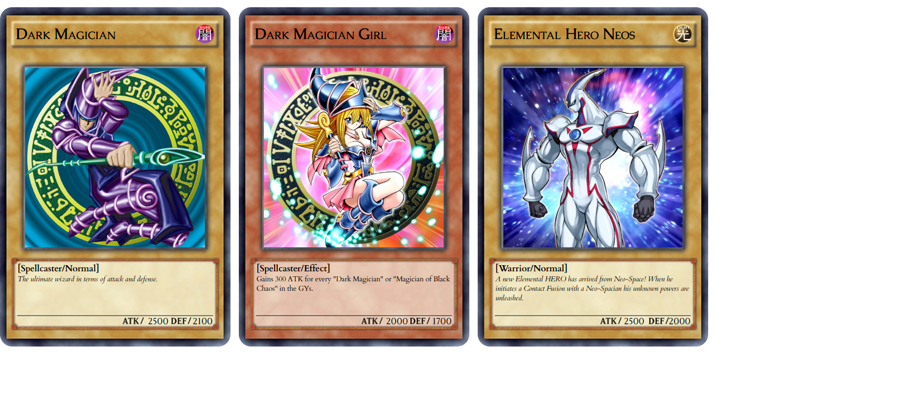

# 🎴 Yu-Gi-Oh! Card Generator

Benvenuti in questo progetto di generazione di carte di Yu-Gi-Oh! creato con **Pug** e **Sass**. Questo sistema permette di creare carte fedeli all'originale in modo modulare e veloce, utilizzando strumenti di sviluppo nativi.

## 🚀 Tecnologie Utilizzate
Il progetto sfrutta la potenza del pre-processing per mantenere il codice pulito e organizzato:
- **HTML5**: Generato dinamicamente tramite **Pug** (Mixin e Struttura).
- **CSS3**: Generato tramite **Sass/SCSS** utilizzando il sistema moderno di moduli (`@use`).
- **Concurrently**: Permette di eseguire la compilazione di Pug e Sass simultaneamente in un unico terminale.
- **Google Fonts**: Font ufficiali (Lustria, Cardo, Caudex).

## 🛠️ Configurazione e Compilazione
Questo progetto **non dipende più da estensioni esterne** (come Compile Hero). Tutto il flusso di lavoro è gestito tramite script Node.js.

### 1. Prerequisiti
È necessario avere installato [Node.js](https://nodejs.org/). Puoi verificarlo con:
```bash
node -v
npm -v
```


###  2. Installazione
Clona il repository e installa le dipendenze di sviluppo necessarie:
```bash
npm install
```

###  3. Modalità Sviluppo (Compilazione Automatica)
Per lavorare al progetto, esegui il seguente comando. Questo monitorerà i tuoi file e compilerà le modifiche all'istante:
```bash
npm run dev
```
Questo comando attiva Sass e Pug contemporaneamente grazie a concurrently.

### 4. Compilazione singola
Se vuoi soltanto generare i file finali senza lasciare processi in esecuzione:
```bash
npm run build
```
Il comando genera `html/index.html` e `css/style.css`. JavaScript viene usato solo dagli strumenti di compilazione; la pagina finale funziona con HTML e CSS statici.

## 📁 Struttura del Progetto
L'organizzazione delle cartelle separa il codice sorgente dai file elaborati letti dal browser:

    ├── assets/             # Immagini, sfondi e attributi originali
    ├── css/                # CSS finale generato (style.css)
    ├── html/               # HTML finale generato (index.html)
    ├── scss/               # Codice sorgente Sass
    │   ├── style.scss      # File principale (Master)
    │   ├── base.scss       # Reset e stili globali
    │   ├── card.scss       # Anatomia della carta
    │   └── variables.scss  # Colori e configurazione
    ├── views/              # Codice sorgente Pug
    │   ├── index.pug       # Pagina principale
    │   ├── _mixins.pug     # Componenti riutilizzabili
    │   └── _cards-data.pug # Database delle carte
    ├── package.json        # Script e dipendenze (Sass, Pug, Concurrently)
    └── README.md

#### Note importanti:
* Esclusioni: I file che iniziano con l'underscore (_) in views/ sono componenti che non vengono compilati come pagine singole; sono usati solo come frammenti all'interno di index.pug.

* Dart Sass: Viene utilizzato @use invece di @import per una migliore gestione di variabili e mixin tra i file.

## 📸 Risultato Finale
Ecco come appaiono le carte una volta compilate:


## 🎨 4. Crediti e Risorse
Tutti gli elementi grafici (frame, attributi, stelle e texture) utilizzati in questo progetto provengono dalla raccolta ufficiale della community:

Assets Originali: https://custom-yugioh-database.fandom.com/wiki/Assets

Un ringraziamento speciale ai contributori della Fandom Wiki per aver reso disponibili queste risorse per i fan.

## 📂 Visualizzazione
Per vedere il progetto finito, apri il file:
`html/index.html`